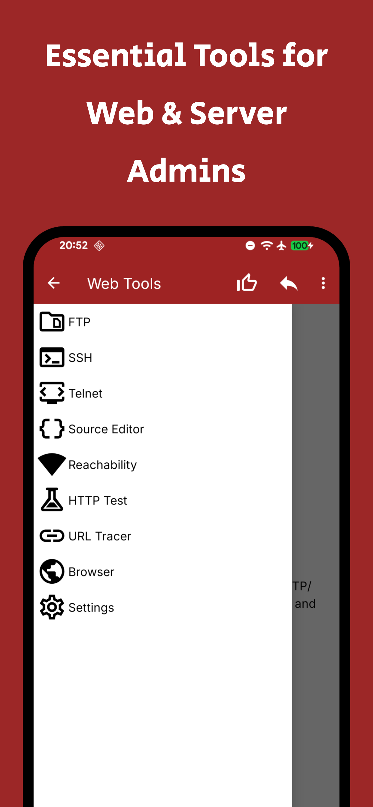

# Web Tools
 

Web Tools is a powerful set of network utilities for managing servers, testing websites and diagnosing connectivity issues — right from your Android device.

Download web tools apk

## Features
* FTP, FTPS & SFTP client. Manage remote files with upload, download, rename, delete, permissions editing. Supports passive/active modes, SSL/TLS encryption and resume for interrupted transfers.
* SSH client. Full terminal emulator with public key authentication, local and remote port forwarding, configurable color schemes and font sizes.
* Telnet client. Interactive terminal for quick access to servers via telnet protocol with VT100 support.
* HTTP client. Test REST APIs with GET, POST, PUT, DELETE, PATCH, HEAD, OPTIONS and TRACE methods. Custom headers, cookies, authentication, request history and syntax-highlighted responses.
* Reachability. Check host reachability via ICMP ping, TCP, UDP and HTTP echo — locally, through intermediate nodes and from remote servers worldwide.
* URL Tracer. Follow complete redirect chains with status codes, response times and server info at each hop.
* Source code viewer. View and edit source code with syntax highlighting, line numbers and active line indication.
* Built-in browser. Configurable web browser with user-agent switching and flexible WebView settings for site testing.

## Possibilities
* Work remotely using a smartphone or tablet.
* Quick detection of any failures and server errors.
* Save and manage connection profiles for FTP, SSH and Telnet.
* Monitor server availability with multi-protocol diagnostics.
* Dark theme support.

## Screenshots
<table>
  <tr>
    <td></td>
	</tr>
</table>
  
## Compatibility
Latest version supports Android 8.0+ (Android APi 26+) and [legacy](https://github.com/BlindZoneApps/web-tools-apk/releases/tag/2.11) version for Android 5.0+ (Android API 21+). All architectures.

## EULA & Privacy Policy
By downloading or opening the application, you accept the [user agreement and privacy policy](https://blindzone.org/eula). 
You may not: copy, modify, translate or create derivative works based on the  Web Tools ("Software"); distribute, transfer, publish, disclose, sublicense, lease, lend, sell or rent the Software to any third party; reverse engineer, decompile, reverse decompile or disassemble the Software, or otherwise attempt to derive the source code; make the functionality of the Software available to third parties or multiple users through any means, or benchmark or conduct any performance or comparison tests on the Software. BlindZone LLC reserves all rights in and to the Software not expressly granted to you under EULA.
